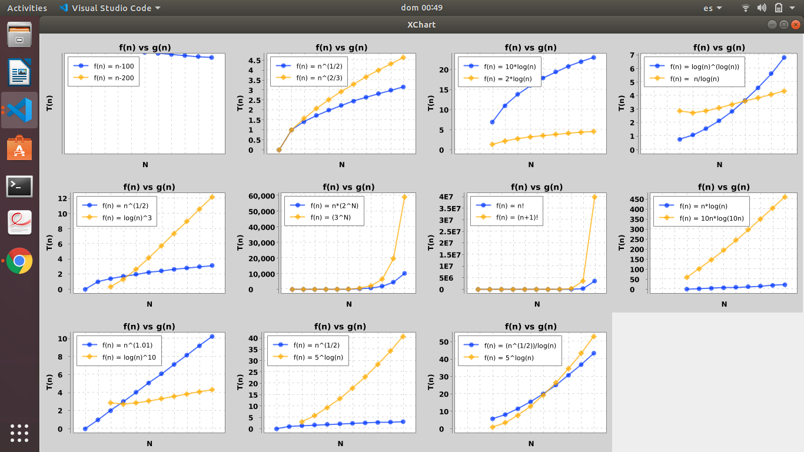
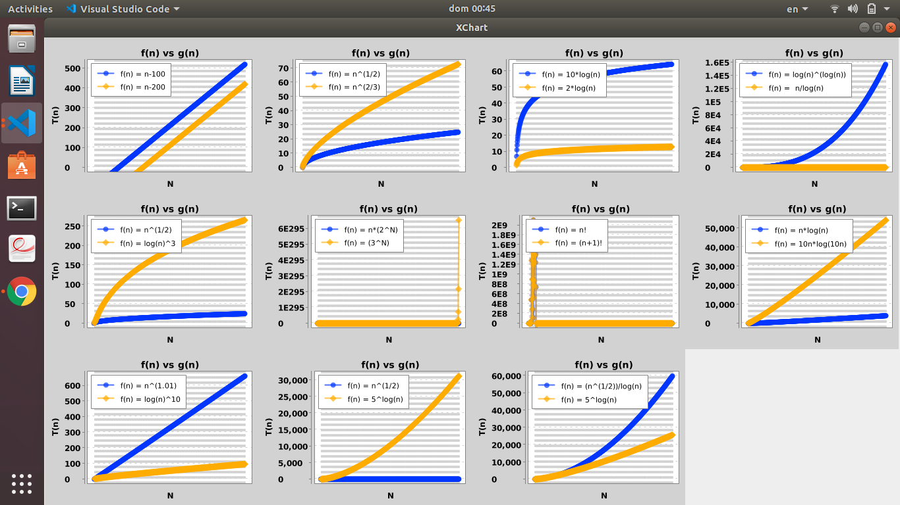

# Graficador de Funciones

Por cada par de funciones f(n) y g(n), escribir si f(n) = Ω(g(n)) , si f(n) = O(g(n)), o bien si f(n) = Θ(g(n)) o decir si ninguna relaci´on se cumple. Desarrollar de manera a verificar los resultados obtenidos. Utilizar alguna librer´ıa Java para graficar las funciones, de manera a corroborar las cotas obtenidas.

1. | f(n) | g(n) |
2. | ----------------------- | --------------------- |
3. | n - 100 | n - 200 |
4. | n2 | n2/3 |
5. | 10.log(n) | log(n2) |
6. | log(n)log(n) | n/log(n) |
7. | n 1/2  | (log(n))3 |
8. | n.2 n | 3 n |
9. | n! | (n+1)! |
10. | n.log(n) | 10.n.log(10n) |
11. | n1.01 | (log(n))3 |
12. | n.2 n | 5 log(n) |
13. | n.2 n | n.log(n) 2 |

# Observacion:

    Utilizamos la libreria de xchart para poder graficar.
    Para las funciones 8 y 9, obtenemos numero que son extremadamente grande por lo tanto tendra un overflow. Asi que sus graficos no estarian muy bien pero para numeros no muy grandes se notaria mejor.
    Utilizado en VSCode.
